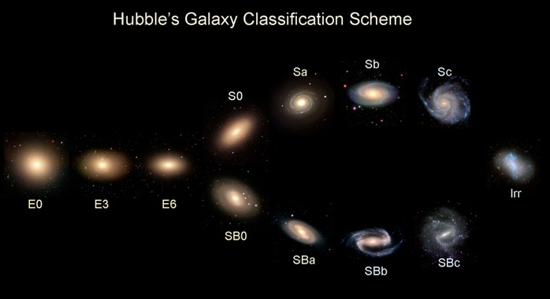
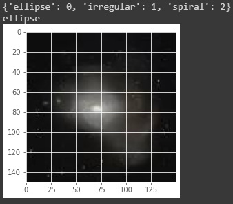

# Galaxy-Zoo-CNN
Galaxy Classification using CNN

Hi! As a demanding public outreach for introducing astrophysics, galaxy zoo is a starter pack. Classifying galaxies based on images is a basic astronomer's visual skill. 

By the Hubble tuning fork, galaxies could be classified as below.

Image from http://astro.physics.uiowa.edu/ITU/labs/foundational-labs/classifying-galaxies/part-1-hubbles-tuning-fork.html

As now, the classifier could only returns elliptical, irregular, and spiral type (on develoment for broader datasets).

# Example
As expected (and sometimes not), it will returned the galaxy's type. 

# Source
The datasets were taken from google search and SDSS. 

The CNN was derived from notebook in deeplearning.ai's Tensorflow course, available at https://github.com/lmoroney/dlaicourse/blob/master/Course%202%20-%20Part%208%20-%20Lesson%202%20-%20Notebook%20(RockPaperScissors).ipynb 

# You could contribute for my future plan to pursue PhD at Stanford too

